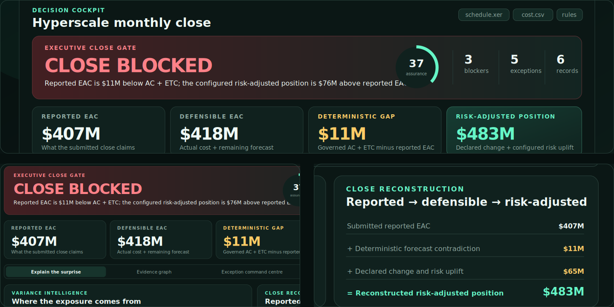

## [EQ-Proof](https://github.com/FlorianStuettgen/EQ-Proof)

Executable monthly-close assurance for Primavera P6, cost, change,
risk, and project-specific controls.

[Control Room](https://florianstuettgen.github.io/EQ-Proof/)
· [Repository](https://github.com/FlorianStuettgen/EQ-Proof)
· [90-second case study](https://github.com/FlorianStuettgen/EQ-Proof/blob/main/docs/SHOWCASE.md#the-90-second-demonstration)

PUBLIC BETA / PYTHON / PROJECT CONTROLS

## [SOC_Replay](https://github.com/FlorianStuettgen/SOC_Replay)

Deterministic defensive-telemetry replay with exact scenario contracts,
indexed/full-scan comparison, and verifiable evidence bundles.

[Reference evidence](https://github.com/FlorianStuettgen/SOC_Replay/blob/2745a95c0d285d11678ce297e5e8468d6b4b9f2e/reference/network-scan/report.md)
· [Repository](https://github.com/FlorianStuettgen/SOC_Replay)

PUBLIC / PYTHON / EVIDENCE ENGINEERING

## Query Cartographer

A local-first system for reasoning about large inherited SQL models.

PRIVATE DEVELOPMENT / SQL SYSTEMS

Field execution → project controls → data systems · Edmonton, Alberta
