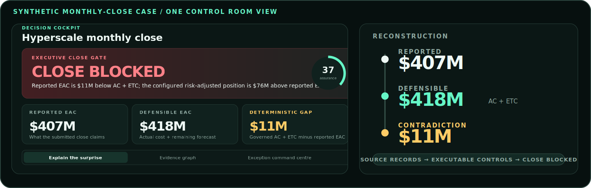

<h1 align="center">Software for Project Controls & Data Assurance</h1>

<strong>I help project-controls leaders find forecast, schedule, change, risk, and reporting contradictions before monthly close.</strong>

Construction delivery · Project controls · SQL · Local-first evidence

  <a href="https://florianstuettgen.github.io/EQ-Proof/">View the working case</a> ·
  <a href="PAID_PILOT.md">Scope a paid pilot</a> ·
  <a href="https://www.linkedin.com/in/florian-stuettgen">Contact on LinkedIn</a>

## The paid outcome

A close package can look plausible and still be internally inconsistent. I review supplied project-controls evidence, reconstruct key positions under explicit controls, and return the contradictions attached to their source records and required actions.

| Buyer question | What I deliver |
| --- | --- |
| Can this close be accepted under the controls we agreed? | A documented **ready**, **review**, or **blocked** conclusion with unresolved assumptions visible. |
| Where does the forecast fail to reconcile? | A submitted-versus-reconstructed bridge tied to the available cost, schedule, change, and risk evidence. |
| What should the team address first? | A ranked exception register with source, control, severity, residual, and remediation. |
| Can another reviewer reproduce the conclusion? | A source manifest, executed-control record, and evidence path from input to decision. |

## Fixed-scope paid pilot

**One project. One reporting period. A defined decision to improve.**

The pilot uses an agreed set of Primavera P6, cost/forecast, change, risk, and optional SQL evidence. 
The standard handoff includes an executive brief, forecast reconciliation, exception register, evidence map, and review session.

[Read the Project Controls Close Integrity Pilot →](PAID_PILOT.md)

## Working proof

### EQ-Proof Control Room

The maintained synthetic case begins with a reported **$407M EAC**. Available detail reconstructs to **$418M**, exposing an **$11M deterministic contradiction** before declared change and risk are considered. The result remains attached to the source evidence and controls that produced it.

[Open the browser workbench](https://florianstuettgen.github.io/EQ-Proof/) · [Review the worked case](https://github.com/FlorianStuettgen/EQ-Proof/blob/main/docs/SHOWCASE.md)

### SQL and reporting-model review

Where reporting logic is part of the problem, I can add a bounded review of inherited SQL: source and metric lineage, join and row-multiplication risk, dialect hazards, privacy exposure, and a validation-required repair plan. 

## Why this works

I am a Project Controls Specialist in construction working at the intersection of project delivery, SQL, data systems, and decision assurance. 
My background combines field and project-delivery context, Fortune 500 client-facing work, graduate business education, and applied data-science training.

The engineering approach is deliberately conservative: local-first processing where supported, explicit semantic boundaries, deterministic outputs, reproducible evidence, and clear non-claims.

## Boundaries

This work is decision support based on supplied evidence and agreed controls. It is not an audit opinion, contractual certification, schedule-engine replacement, probabilistic risk model, or production system of record. 
I do not modify production data during a diagnostic, and confidential material is never submitted through a public demo or public GitHub issue.

## Additional engineering evidence

[SOC_Replay](https://github.com/FlorianStuettgen/SOC_Replay) demonstrates the same evidence-first approach in a different domain: deterministic defensive-telemetry replay with exact scenario contracts and verifiable evidence bundles.

## Contact

For a consulting discussion, [contact me on LinkedIn](https://www.linkedin.com/in/florian-stuettgen). Include your role, project type, reporting period, available export types, and the decision date you are working toward. Do not send confidential files in the first message.

