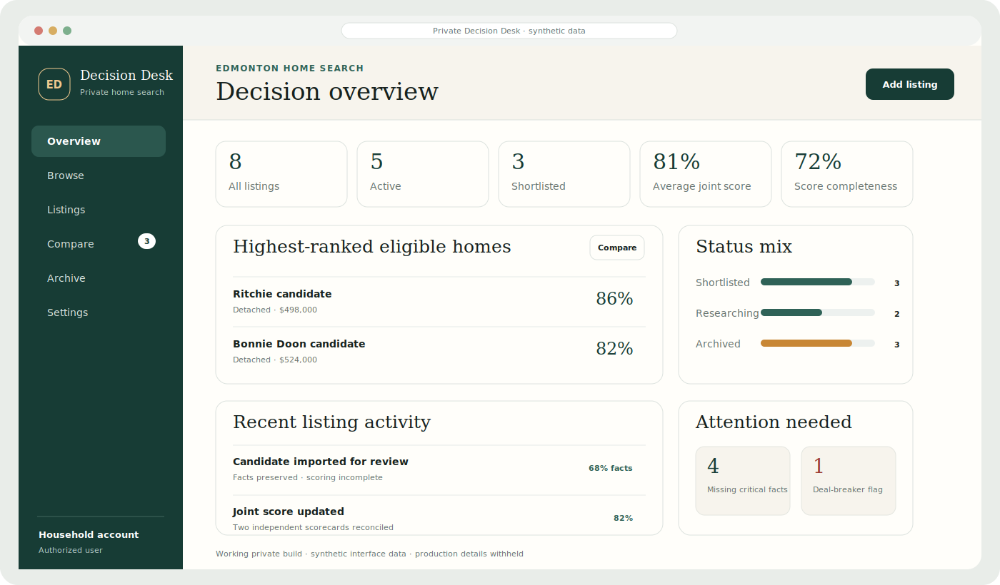

Most failures announce themselves.

The expensive ones arrive as polished answers everyone has already started using.

These projects begin where the answer still looks reasonable, but the evidence underneath it no longer agrees.

## [EQ-Proof](https://github.com/FlorianStuettgen/EQ-Proof)

**The monthly close says $407M. The governed detail says $418M. EQ-Proof finds the difference before it becomes the next baseline.**

Load Primavera P6, cost, change, and risk exports. EQ-Proof independently rebuilds the position, runs the project's own equations as controls, and turns every contradiction into a traceable correction instead of another unexplained red cell.

  

<table>
<tr>
<td width="33%" valign="top"><strong>Stop bad numbers at the gate</strong> A close cannot pass while its summary contradicts the records beneath it.</td>
<td width="33%" valign="top"><strong>Put project logic to work</strong> Project-specific equations execute every close instead of living in someone's workbook.</td>
<td width="33%" valign="top"><strong>Send the fix with the finding</strong> Each exception carries the failed rule, source records, residual, and required correction.</td>
</tr>
</table>

[Open the Control Room](https://florianstuettgen.github.io/EQ-Proof/) · [Follow the worked case](https://github.com/FlorianStuettgen/EQ-Proof/blob/main/docs/SHOWCASE.md) · [See how it is built](https://github.com/FlorianStuettgen/EQ-Proof/blob/main/docs/PRODUCT_ARCHITECTURE.md)

## [SOC_Replay](https://github.com/FlorianStuettgen/SOC_Replay)

<table>
<tr>
<td width="44%" valign="top">
  
</td>
<td width="56%" valign="top">
  
<strong>An alert is easy to generate. A result another analyst can reproduce is much harder.</strong>

  
The rack is the controlled lab: segmented compute, storage, network enforcement, Suricata telemetry, and recovery access. SOC_Replay is the evidence layer that proves what happened inside it.

  
Every scenario runs through an optimized detector and a slower full-scan reference. If the meaning changes, the speedup fails. The completed run leaves a bundle that can be inspected and verified without trusting the original machine.

  
<a href="https://github.com/FlorianStuettgen/SOC_Replay#the-90-second-proof">Run the 90-second proof</a> · <a href="https://github.com/FlorianStuettgen/SOC_Replay/blob/main/docs/16-Engineering-Review.md">Read the engineering review</a> · <a href="https://github.com/FlorianStuettgen/SOC_Replay/blob/main/docs/22-Execution-Core.md">Inspect the execution core</a>

</td>
</tr>
</table>

<table>
<tr>
<td width="33%" valign="top"><strong>Prove why the alert fired</strong> The rule, evidence events, severity, and expected outcome remain attached.</td>
<td width="33%" valign="top"><strong>Prove the speedup did not cheat</strong> Indexed execution must match the reference path before performance counts.</td>
<td width="33%" valign="top"><strong>Hand off a run, not a screenshot</strong> Reports, traces, ledger, manifest, and hashes verify as one portable bundle.</td>
</tr>
</table>

## Query Cartographer

PRIVATE DEVELOPMENT

> **One line changes. Every query still runs. Three reports quietly stop meaning what they meant yesterday.**

Query Cartographer is being built for inherited SQL estates where the code is visible and the ownership is not. Before a change is made, it asks the question comments and unit tests rarely answer:

> **What else is this query holding together?**

Private development. The implementation stays closed until the map can be trusted under real change.

`local-first` · `inherited SQL` · `change impact`

## [Real Estate Decision Desk](https://github.com/FlorianStuettgen/real-estate-decision-desk)

**The highest-scoring house is not necessarily the best house. It may only be the one with the most flattering assumptions.**

Real Estate Decision Desk is a private two-person web app that turns house hunting into a decision trail: capture candidates, enforce non-negotiables, score independently, compare disagreements, model costs, attach evidence, and test whether the winner survives uncertainty.

  

WORKING PRIVATE BUILD · SYNTHETIC PUBLIC DATA · PUBLIC CODE REVIEW IN PROGRESS

<table>
<tr>
<td width="33%" valign="top"><strong>Kill weak options early</strong> Budget, space, property type, garage, location, and other non-negotiables fail before preference can rescue them.</td>
<td width="33%" valign="top"><strong>Make disagreement visible</strong> Independent scorecards, joint scores, deal-breakers, missing facts, and confidence remain separate.</td>
<td width="33%" valign="top"><strong>Keep the why attached</strong> Files, notes, costs, scores, and the advance-or-reject rationale survive the decision.</td>
</tr>
</table>

[Review the working build](https://github.com/FlorianStuettgen/real-estate-decision-desk/pull/1) · [Browse the public code](https://github.com/FlorianStuettgen/real-estate-decision-desk/tree/feat/salvage-day1-mvp) · [Read the product specification](https://github.com/FlorianStuettgen/real-estate-decision-desk/blob/feat/salvage-day1-mvp/docs/PRODUCT_SPEC.md)

## The through-line

**Most software preserves the answer. I build for the moment the answer is challenged.**

Across forecasts, detections, SQL changes, and household decisions, the work is the same: keep the assumptions, evidence, and consequences close enough that a polished result can still be questioned before it becomes expensive.

That perspective comes from field execution and project controls, where schedule, cost, risk, procurement, and site reality rarely agree—and where losing the path behind a number is often more dangerous than the number itself.