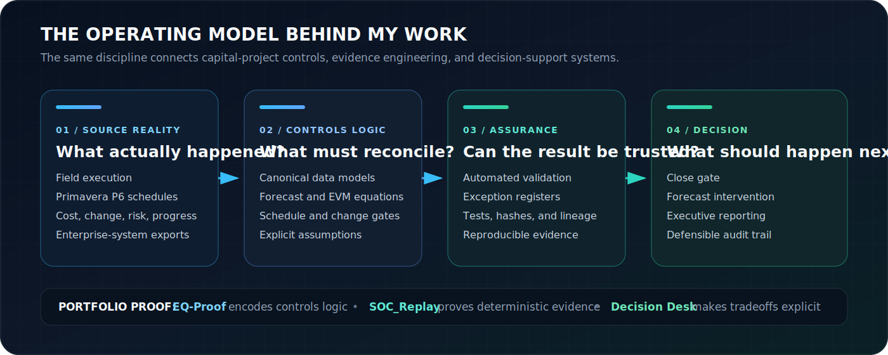

<p align="center">
  
</p>

<p align="center">
  <a href="#the-60-second-profile">60-second profile</a> ·
  <a href="#flagship-systems">Flagship systems</a> ·
  <a href="#what-i-can-be-trusted-to-own">Operating value</a> ·
  <a href="#technical-reviewer-index">Technical evidence</a>
</p>

## Most project-reporting failures begin before the dashboard

A schedule can be valid and still disagree with the forecast. A cost report can balance and still contain an impossible EAC. A dashboard can look precise while its assumptions, transformations, and exceptions remain invisible.

I work on that layer.

I turn fragmented cost, schedule, risk, change, procurement, and field-execution data into systems that can be **reconciled, challenged, reproduced, and defended**.

My perspective comes from both sides of the workface: I began as a Journeyman Steamfitter-Pipefitter in heavy industrial construction, moved into project controls and capital-program delivery, and then into SQL, Python, automation, and data-system design.

> **Field execution taught me where project data loses reality. Project controls taught me where that loss becomes expensive. Data engineering gave me the means to encode the checks.**

<p align="center">
  
</p>

## The 60-second profile

**What I am:** a project-controls and data-systems specialist with 10+ years across heavy industrial construction, major capital programs, LNG megaproject delivery, and national shipbuilding environments.

**What I build:** integrated controls datasets, reporting pipelines, assurance rules, forecast models, exception registers, and executive analytics that preserve lineage back to source logic.

**What makes me different:** I can move between field execution, controls governance, commercial context, and technical implementation without treating any one of them as a black box.

**What I optimize for:** decisions that remain explainable after the meeting, repeatable next month, and defensible under technical or commercial challenge.

---

## Flagship systems

### 01 — [EQ-Proof](https://github.com/FlorianStuettgen/EQ-Proof) · Project-controls assurance

<a href="https://github.com/FlorianStuettgen/EQ-Proof">
  
</a>

EQ-Proof asks a question most reporting systems skip:

> **Are the numbers internally admissible before they are visualized?**

It converts Primavera P6 XER files and cost-system exports into an executable close gate. Forecast, earned-value, change, risk, and schedule relationships are evaluated as versioned controls rather than copied spreadsheet formulas.

| Operating problem | Implemented response |
| --- | --- |
| EAC, AC, and ETC disagree | Executable equation catalogue with ranked blockers |
| P6 status contradicts remaining duration | Native XER parsing and schedule-assurance rules |
| Governance is trapped in monthly workbooks | Reusable client equation packs and canonical aliases |
| Review depends on visual inspection | Machine-readable JSON, exception CSV, and close-decision report |
| Results cannot be reproduced | Deterministic processing, tests, CI, CodeQL, and a 92% coverage gate |

**What this proves about me:** I can take domain governance that normally lives in spreadsheets and expert memory, define its operating boundary, model it safely, implement it, and produce evidence that a technical reviewer can inspect.

[Run the example](https://github.com/FlorianStuettgen/EQ-Proof#the-useful-part) · [Review the controls model](https://github.com/FlorianStuettgen/EQ-Proof/blob/main/docs/PROJECT_CONTROLS.md) · [Inspect the tests](https://github.com/FlorianStuettgen/EQ-Proof/blob/main/tests/test_controls.py)

---

### 02 — [SOC_Replay](https://github.com/FlorianStuettgen/SOC_Replay) · Evidence engineering

<a href="https://github.com/FlorianStuettgen/SOC_Replay">
  
</a>

SOC_Replay is intentionally outside my primary project-controls domain. That is the point: it demonstrates whether the engineering discipline transfers.

The system compiles inspectable detection rules, evaluates synthetic or sanitized telemetry, verifies exact expectations, and produces integrity-checkable experiment bundles through a five-stage execution pipeline.

| Engineering claim | Repository evidence |
| --- | --- |
| Execution is deterministic | Semantic plan fingerprints and ordered stage outputs |
| Internal tampering is observable | Cryptographically linked execution ledger |
| Tests include meaningful controls | Positive, repeated-window, and zero-detection scenarios |
| The package has a constrained authority boundary | Simulation-only response model and no live-I/O execution surface |
| Quality is enforced rather than described | Strict typing, linting, 90%+ branch coverage, self-audit, and wheel build |

**What this proves about me:** I do not rely on domain familiarity to hide weak engineering. I can design contracts, boundaries, pipelines, evidence, verification, and documentation that survive inspection on their own merits.

[Run the 90-second proof](https://github.com/FlorianStuettgen/SOC_Replay#the-90-second-proof) · [Read the execution core](https://github.com/FlorianStuettgen/SOC_Replay/blob/main/docs/22-Execution-Core.md) · [Inspect the ledger design](https://github.com/FlorianStuettgen/SOC_Replay/blob/main/docs/23-Execution-Ledger.md)

---

### 03 — [Real Estate Decision Desk](https://github.com/FlorianStuettgen/real-estate-decision-desk) · Decision architecture

This design-stage project applies the same operating philosophy to household property selection: mandatory gates before weighted preferences, evidence separated from assumptions, costs separated from uncertainty, and sensitivity analysis before commitment.

It is deliberately labelled as design-stage work. The repository demonstrates product framing, decision modelling, data architecture, and honest maturity boundaries—not completed software.

**What this proves about me:** I model decisions, not merely databases. A technically correct system is insufficient if it hides uncertainty, permits non-negotiables to be averaged away, or cannot explain why a decision changed.

---

## What I can be trusted to own

I create the most value where an organization has important project information but does not yet have a trustworthy system around it:

- cost, schedule, risk, change, procurement, and progress data that disagree across contractors or platforms;
- monthly reporting assembled through fragile workbook chains and manual reconciliation;
- forecasts that look credible but cannot be bridged to detail, assumptions, or approved change;
- Power BI or executive reporting that lacks durable source logic and auditability;
- controls requirements that exist as tribal knowledge instead of reusable rules;
- field and project teams that need a translator between operating reality, governance, and data engineering.

The objective is not to automate every judgment. It is to automate the repeatable logic, expose the exceptions, preserve the assumptions, and leave accountable decisions with people.

## Why the career arc matters

| Layer | What it added |
| --- | --- |
| **Field execution** | Understanding of constructability, sequencing, constraints, progress, supervision, and the gap between reported status and physical reality |
| **Project controls** | Forecasting, earned value, change, risk, schedule assurance, stage-gate governance, and executive decision requirements |
| **Data engineering** | SQL models, Python tooling, ETL, validation, automation, schemas, tests, reproducibility, and technical documentation |
| **Commercial context** | Dual MBA training that connects technical outputs to governance, operating models, and business decisions |
| **Applied analytics** | MIT data-science training used as an implementation discipline rather than a credential substitute |

I am not trying to become a software engineer who once visited a project site, or a project-controls professional who occasionally scripts. The value is in maintaining all three perspectives at once.

## Technical reviewer index

| System | Start here | Architecture and boundaries | Verification |
| --- | --- | --- | --- |
| **EQ-Proof** | [Project-controls workbench](https://github.com/FlorianStuettgen/EQ-Proof/blob/main/docs/PROJECT_CONTROLS.md) | [Architecture](https://github.com/FlorianStuettgen/EQ-Proof/blob/main/docs/ARCHITECTURE.md) · [Threat model](https://github.com/FlorianStuettgen/EQ-Proof/blob/main/docs/THREAT_MODEL.md) | [Controls tests](https://github.com/FlorianStuettgen/EQ-Proof/blob/main/tests/test_controls.py) · [CI workflow](https://github.com/FlorianStuettgen/EQ-Proof/blob/main/.github/workflows/ci.yml) |
| **SOC_Replay** | [90-second proof](https://github.com/FlorianStuettgen/SOC_Replay#the-90-second-proof) | [System architecture](https://github.com/FlorianStuettgen/SOC_Replay/blob/main/docs/01-Architecture.md) · [Implementation state](https://github.com/FlorianStuettgen/SOC_Replay/blob/main/docs/14-Implementation-State.md) | [Test suite](https://github.com/FlorianStuettgen/SOC_Replay/tree/main/tests) · [Quality gate](https://github.com/FlorianStuettgen/SOC_Replay#quality-gate) |
| **Decision Desk** | [Decision workflow](https://github.com/FlorianStuettgen/real-estate-decision-desk#decision-workflow) | [Data architecture](https://github.com/FlorianStuettgen/real-estate-decision-desk#data-architecture) | [Current maturity boundary](https://github.com/FlorianStuettgen/real-estate-decision-desk#status) |

## Working principle

```text
Do not make uncertainty prettier.
Make the source logic visible.
Make the controls executable.
Make exceptions impossible to ignore.
Make the decision reproducible.
```

<p align="center">
  <strong>Field-built judgment · Project-controls discipline · Data-engineering rigor</strong>
</p>