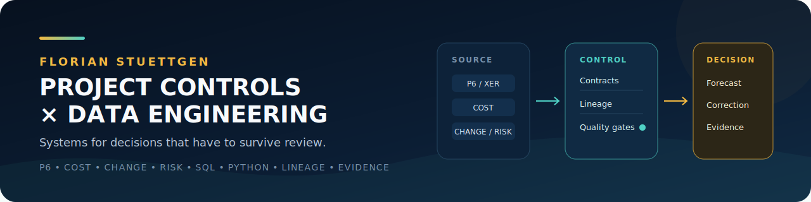
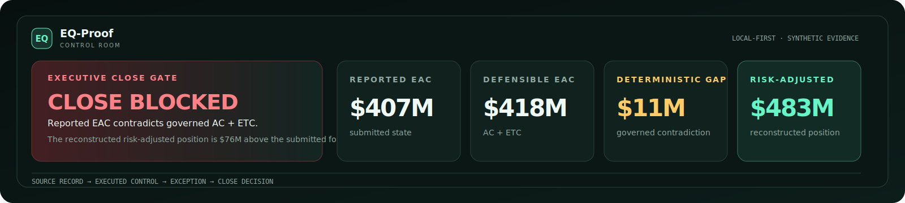

  

I build governed data systems for environments where schedule, cost, change, risk, and operational reality do not naturally agree. My background combines **10+ years in project delivery and controls**, an **MBA**, and **MIT Applied Data Science** training.

<table>
<tr>
<td width="25%" valign="top"><strong>Project controls</strong> Primavera P6/XER, cost, change, risk, forecasting</td>
<td width="25%" valign="top"><strong>Data systems</strong> Python, SQL, TypeScript, schemas, lineage, deterministic pipelines</td>
<td width="25%" valign="top"><strong>Engineering proof</strong> 180+ public tests, 93%+ branch coverage, CI/CD, reproducible artifacts</td>
<td width="25%" valign="top"><strong>Operating principle</strong> Keep the assumptions, evidence, and consequences attached to the answer</td>
</tr>
</table>

[LinkedIn](https://www.linkedin.com/in/florian-stuettgen/) · [Open the EQ-Proof Control Room](https://florianstuettgen.github.io/EQ-Proof/) · [Review the engineering portfolio](#selected-work)

> **Most software preserves the answer. I build for the moment the answer is challenged.**

## Selected work

### [EQ-Proof](https://github.com/FlorianStuettgen/EQ-Proof) — project-controls assurance

**The monthly close says $407M. The governed detail says $418M. EQ-Proof finds the difference before it becomes the next baseline.**

Load Primavera P6, cost, change, and risk exports. EQ-Proof independently reconstructs the position, executes project-specific equations as controls, and turns contradictions into traceable corrections instead of unexplained spreadsheet exceptions.

  

<table>
<tr>
<td width="33%" valign="top"><strong>Gate the close</strong> A summary cannot pass while it contradicts the governed records beneath it.</td>
<td width="33%" valign="top"><strong>Execute the logic</strong> Project equations run as versioned controls instead of living in someone's workbook.</td>
<td width="33%" valign="top"><strong>Preserve the correction</strong> Every exception carries the rule, source records, residual, and required action.</td>
</tr>
</table>

`Python` · `P6/XER` · `data contracts` · `lineage` · `cryptographic attestation` · `95%+ branch coverage`

[Open the live application](https://florianstuettgen.github.io/EQ-Proof/) · [Follow the worked case](https://github.com/FlorianStuettgen/EQ-Proof/blob/main/docs/SHOWCASE.md) · [Inspect the architecture](https://github.com/FlorianStuettgen/EQ-Proof/blob/main/docs/PRODUCT_ARCHITECTURE.md)

### Query Cartographer — data-lineage and change-impact analysis

PRIVATE DEVELOPMENT

> **One line changes. Every query still runs. Three reports quietly stop meaning what they meant yesterday.**

Query Cartographer is being built for inherited SQL estates where the code is visible and the ownership is not. It maps dependencies, data movement, metric meaning, and downstream change risk before a repair is allowed to look local.

`SQL` · `lineage` · `impact analysis` · `data contracts` · `local-first`

The implementation remains private until its maps can be trusted under real change.

### [SOC_Replay](https://github.com/FlorianStuettgen/SOC_Replay) — reproducible pipelines under adversarial conditions

<table>
<tr>
<td width="40%" valign="top">
  
</td>
<td width="60%" valign="top">
  
<strong>An alert is easy to generate. A result another analyst can reproduce is much harder.</strong>

  
SOC_Replay treats defensive telemetry as a governed data product: normalize heterogeneous events, compile deterministic execution plans, prove indexed and full-scan equivalence, and emit a content-addressed evidence bundle.

  
<strong>51 automated tests · 93% branch coverage · strict typing · deterministic builds</strong>

  
<a href="https://github.com/FlorianStuettgen/SOC_Replay#the-90-second-proof">Run the 90-second proof</a> · <a href="https://github.com/FlorianStuettgen/SOC_Replay/blob/main/docs/16-Engineering-Review.md">Read the engineering review</a>

</td>
</tr>
</table>

### [Real Estate Decision Desk](https://github.com/FlorianStuettgen/real-estate-decision-desk) — decision-product design

**The highest-scoring house is not necessarily the best house. It may only be the one with the most flattering assumptions.**

A local-first, two-person decision system that separates mandatory gates, independent preferences, uncertainty, evidence, and the final advance-or-reject rationale. It applies the same governing principle to a different domain: preserve why the decision was made, not only what was selected.

[Review the working build](https://github.com/FlorianStuettgen/real-estate-decision-desk/pull/1) · [Read the product specification](https://github.com/FlorianStuettgen/real-estate-decision-desk/blob/feat/salvage-day1-mvp/docs/PRODUCT_SPEC.md)

## The through-line

Across forecasts, SQL changes, security detections, and household decisions, the work is the same: keep assumptions, evidence, and consequences close enough that a polished result can still be questioned before it becomes expensive.

I am most useful where **project delivery and data platforms meet**—governed reporting, schedule/cost integration, lineage, data-quality controls, forecasting, operational analytics, and decision systems that must remain explainable under review.

**Interested in that intersection? [Connect with me on LinkedIn](https://www.linkedin.com/in/florian-stuettgen/).**
