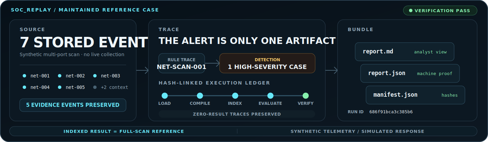
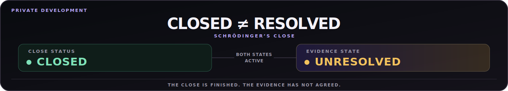

<h1 align="center">The result is not the proof.</h1>

A forecast can be reported. A detection can fire. A close can be signed. The interesting part begins when one is questioned.

## EQ-Proof

**Every number looked plausible. Together, they were impossible.**

**EQ-Proof** rebuilds the close from source records and executable controls, leaving the contradiction attached to the evidence that exposed it.

[Enter the Control Room →](https://florianstuettgen.github.io/EQ-Proof/)

## SOC_Replay

**Most detection demos stop at the alert. SOC_Replay preserves the case.**

Each run accounts for the events it saw, every rule trace—including zero results—the execution path it took, and the bundle it left behind.

[Open the reference case →](https://github.com/FlorianStuettgen/SOC_Replay/blob/2745a95c0d285d11678ce297e5e8468d6b4b9f2e/reference/network-scan/report.md)

## Closed ≠ resolved

The close is finished. The evidence has not agreed.

**Schrödinger’s Close** · Private development.
