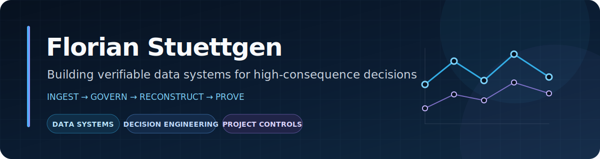

  

Most operational systems are good at producing an answer. They are much worse at showing whether the answer is internally consistent, what changed it, and whether someone else can reproduce it.

That is the territory I tend to work in.

## [EQ-Proof](https://github.com/FlorianStuettgen/EQ-Proof)

**When a monthly close is wrong, the problem is often not one number. It is the relationship between several numbers that are all individually plausible.**

EQ-Proof takes ordinary Primavera P6, cost, change, and risk exports and reconstructs the position independently. User-written equations become executable controls; failed relationships become traceable exceptions; and the path from source record to close decision remains visible.

The useful part is not another dashboard. It is a way to ask whether a reported position can actually be defended before it is accepted, circulated, or built into the next forecast.

[Open the synthetic Control Room](https://florianstuettgen.github.io/EQ-Proof/) · [Follow the worked case](https://github.com/FlorianStuettgen/EQ-Proof/blob/main/docs/SHOWCASE.md) · [See the product architecture](https://github.com/FlorianStuettgen/EQ-Proof/blob/main/docs/PRODUCT_ARCHITECTURE.md)

  

## [SOC_Replay](https://github.com/FlorianStuettgen/SOC_Replay)

**A detection firing is not the same as proving the detector behaved correctly.**

SOC_Replay executes defensive telemetry scenarios as exact contracts. Its optimized indexed path is checked against a deliberately slower full-scan reference, every rule leaves an execution trace even when it detects nothing, and the final reports are tied together as a verifiable evidence bundle.

The unusual part is that optimization is treated as something that must preserve meaning, not merely improve speed. The project is less interested in dramatic alerts than in whether the same inputs can produce the same explainable result again.

[Run the 90-second proof](https://github.com/FlorianStuettgen/SOC_Replay#the-90-second-proof) · [Read the engineering review](https://github.com/FlorianStuettgen/SOC_Replay/blob/main/docs/16-Engineering-Review.md) · [Inspect the execution core](https://github.com/FlorianStuettgen/SOC_Replay/blob/main/docs/22-Execution-Core.md)

## Other directions

### Query Cartographer

**Large SQL systems become dangerous when nobody can say what a small change will disturb.**

This private project maps inherited queries into structure, dependencies, lineage, and change risk before modification. The goal is not to make complicated SQL look simple. It is to make the consequences of touching it less mysterious.

### [Real Estate Decision Desk](https://github.com/FlorianStuettgen/real-estate-decision-desk)

**A precise ranking is not necessarily a reliable decision.**

This design-stage project applies the same thinking to property comparison: hard constraints before preferences, costs separated from assumptions, uncertainty kept visible, and sensitivity analysis used to show when a preferred option is fragile.

## The recurring question

Across these projects, I keep returning to the same problem:

> Can a system explain why its answer should be trusted, where that answer came from, and what would cause it to change?

I came to software through field execution and project controls, where schedule, cost, risk, procurement, and site reality rarely agree cleanly. That background is why I tend to treat assumptions, exceptions, lineage, and reproducibility as parts of the product rather than documentation added afterward.

Edmonton, Alberta · Python, SQL, JavaScript, project-controls data, and the systems around them