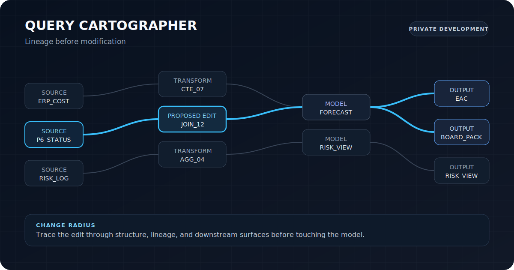

Most of the systems here began with an answer that looked reasonable.

The interesting part starts when two reasonable answers cannot both be true.

I tend to work at that boundary: reconstructing the answer, exposing the relationships underneath it, and leaving enough evidence for the next person to challenge it.

## [EQ-Proof](https://github.com/FlorianStuettgen/EQ-Proof)

**$407M reported. $418M reconstructed from the governed detail.**

EQ-Proof begins with that disagreement. It reads ordinary Primavera P6, cost, change, and risk exports, then executes the relationships the project says should hold.

User-written equations become controls. A failed relationship stays attached to the affected records, residual, reconstructed position, and close decision.

<code>independent reconstruction</code> · <code>executable controls</code> · <code>evidence lineage</code>

[Open the Control Room](https://florianstuettgen.github.io/EQ-Proof/) · [Follow the worked case](https://github.com/FlorianStuettgen/EQ-Proof/blob/main/docs/SHOWCASE.md) · [See how it is built](https://github.com/FlorianStuettgen/EQ-Proof/blob/main/docs/PRODUCT_ARCHITECTURE.md)

  

## [SOC_Replay](https://github.com/FlorianStuettgen/SOC_Replay)

<table>
<tr>
<td width="44%" valign="top">
  
</td>
<td width="56%" valign="top">
  
<strong>A detector can become faster and still stop meaning the same thing.</strong>

  
The rack is the physical side of SOC_Replay: segmented compute, storage, network enforcement, telemetry, and out-of-band recovery.

  
The repository follows what happens after telemetry becomes evidence. An indexed execution path runs beside a slower full-scan reference. Rules that detect nothing still leave traces. Reports, manifests, and execution identities are checked as one bundle.

  
<code>reference execution</code> · <code>zero-result traces</code> · <code>verifiable bundles</code>

  
<a href="https://github.com/FlorianStuettgen/SOC_Replay#the-90-second-proof">Run the 90-second proof</a> · <a href="https://github.com/FlorianStuettgen/SOC_Replay/blob/main/docs/16-Engineering-Review.md">Engineering review</a> · <a href="https://github.com/FlorianStuettgen/SOC_Replay/blob/main/docs/22-Execution-Core.md">Execution core</a>

</td>
</tr>
</table>

<table>
<tr>
<td width="33%" valign="top"><strong>Reference path</strong> The slower implementation remains beside the optimized path.</td>
<td width="33%" valign="top"><strong>Zero-result trace</strong> A rule that correctly finds nothing still records how it arrived there.</td>
<td width="33%" valign="top"><strong>Bundle identity</strong> The report, ledger, manifest, and artifacts must agree with one another.</td>
</tr>
</table>

## Query Cartographer

PRIVATE DEVELOPMENT

<table>
<tr>
<td width="55%" valign="top">
  
<strong>A small SQL edit can carry a large and mostly invisible blast radius.</strong>

  
Query Cartographer maps inherited SQL into structure, lineage, dependencies, and likely downstream movement before modification.

  
Most of the implementation remains private. The teaser is limited to the question it is built around: not only what a query says, but what it quietly holds together.

  
<code>dependency graph</code> · <code>lineage</code> · <code>change radius</code>

</td>
<td width="45%" valign="top">
  
</td>
</tr>
</table>

## [Real Estate Decision Desk](https://github.com/FlorianStuettgen/real-estate-decision-desk)

<table>
<tr>
<td width="48%" valign="top">
  
</td>
<td width="52%" valign="top">
  
<strong>A ranking can be precise and still collapse when one assumption moves.</strong>

  
Real Estate Decision Desk separates mandatory gates from preferences, observed costs from estimates, and evidence from confidence. The ranking is then tested against changes in repair exposure, commute weight, financing, or incomplete documentation.

  
The repository remains at the product-definition stage. The decision model is being made explicit before the interface hardens around it.

  
<code>hard gates</code> · <code>cost + risk</code> · <code>sensitivity</code>

  
<a href="https://github.com/FlorianStuettgen/real-estate-decision-desk">Explore the decision model</a>

</td>
</tr>
</table>

<table>
<tr>
<td width="33%" valign="top"><strong>Gates</strong> Non-negotiables fail before weighted preferences can compensate.</td>
<td width="33%" valign="top"><strong>Cost</strong> Facts, estimates, planned work, and risk allowance remain separate.</td>
<td width="33%" valign="top"><strong>Sensitivity</strong> The preferred option is retested when uncertain inputs move.</td>
</tr>
</table>

## One recurring question

> What must a system preserve so that its answer can be challenged without becoming impossible to reconstruct?

That question followed me from field execution into project controls and software. Schedule, cost, risk, procurement, and site reality rarely disagree politely.