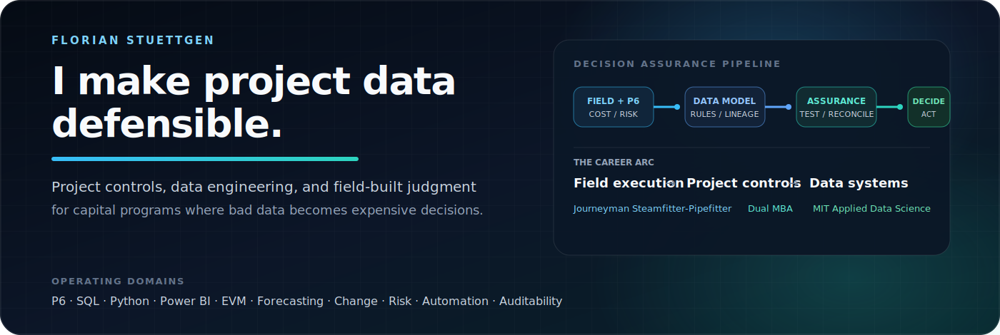

<p align="center">
  
</p>

<p align="center">
  <a href="https://github.com/FlorianStuettgen/EQ-Proof"></a>
  <a href="https://github.com/FlorianStuettgen/SOC_Replay"></a>
  
  
</p>

## I turn fragmented project data into decision systems

I build project-controls and data-engineering solutions for complex capital programs, where cost, schedule, risk, procurement, and field-execution data rarely arrive clean, aligned, or decision-ready.

My work sits at the intersection of three disciplines:

- **Project controls:** forecasting, earned value, change, risk, schedule assurance, and governance.
- **Data systems:** SQL models, Python tooling, ETL pipelines, automation, analytics, and reproducible outputs.
- **Field execution:** practical understanding of how plans, progress, constraints, and reporting behave outside the spreadsheet.

The objective is not another dashboard. It is a traceable operating system for answering:

> What was planned, what is happening, where is performance drifting, and what evidence supports the decision?

## Selected work

<table>
<tr>
<td width="50%" valign="top">

### [EQ-Proof](https://github.com/FlorianStuettgen/EQ-Proof)

**Executable assurance for project-controls data.**

Turns Primavera P6 XER files and cost-system exports into a repeatable close gate. It checks cost, earned-value, change, risk, and schedule relationships before inconsistent data reaches executive reporting.

**Engineering evidence**

- Native P6 XER and tabular cost ingestion
- Versioned equation catalogue and client rule packs
- Ranked exception registers and automation-ready exit codes
- CI, CodeQL, deterministic evidence, and a 92% coverage gate

</td>
<td width="50%" valign="top">

### [SOC_Replay](https://github.com/FlorianStuettgen/SOC_Replay)

**A deterministic, evidence-first cyber range.**

Combines a segmented physical lab with an offline detection engine that compiles inspectable rules, evaluates synthetic or sanitized telemetry, and produces integrity-checkable experiment bundles.

**Engineering evidence**

- Explicit compile, index, evaluate, and verify pipeline
- Cryptographically linked execution ledger
- Positive, repeated-window, and negative controls
- Strict typing, linting, 90%+ branch coverage, and wheel builds

</td>
</tr>
<tr>
<td width="50%" valign="top">

### [Real Estate Decision Desk](https://github.com/FlorianStuettgen/real-estate-decision-desk)

**Traceable household decision support.**

A design-stage system for comparing property listings through mandatory gates, weighted criteria, cost exposure, uncertainty, sensitivity analysis, and preserved decision rationale.

**Current boundary**

The repository documents the product architecture and minimum viable workflow without presenting concept work as completed software.

</td>
<td width="50%" valign="top">

### Current direction

I am developing tools that make complex operational decisions more:

- **consistent** through explicit rules and shared data models;
- **auditable** through preserved assumptions and evidence;
- **repeatable** through code, tests, and deterministic outputs;
- **useful** by connecting technical correctness to real operating decisions.

</td>
</tr>
</table>

## What I build

| Capability | Typical output |
| --- | --- |
| Integrated project-controls data | Cost, schedule, risk, change, procurement, and progress models |
| Reporting automation | Repeatable pipelines replacing manual workbook assembly |
| Controls assurance | Reconciliation rules, exception registers, quality gates, and audit trails |
| Forecast intelligence | Variance analysis, trend logic, scenario testing, and decision-ready datasets |
| Executive analytics | Power BI and structured reporting grounded in traceable source logic |
| Engineering documentation | Architecture, operating boundaries, validation evidence, and reproducible workflows |

## How I approach engineering

**Evidence over appearance.** A polished interface is useful; a reproducible result is stronger.

**Explicit boundaries over implied capability.** Design-stage work, simulated systems, and production-ready components should never be presented as the same thing.

**Systems over spreadsheet heroics.** Important controls should live in reusable models, rules, tests, and pipelines—not in one person’s monthly workbook.

**Field reality over abstract optimization.** Data structures must reflect how work is authorized, sequenced, executed, measured, challenged, and changed.

**Traceability over false precision.** A decision is only as defensible as its assumptions, lineage, and uncertainty are visible.

## Technical toolkit

| Domain | Tools and methods |
| --- | --- |
| Project controls | Primavera P6, earned value, forecasting, variance analysis, change control, risk, stage-gate readiness |
| Data engineering | SQL, Python, ETL, data modelling, validation, automation, deterministic processing |
| Analytics | Power BI, Excel, Power Query, VBA, executive reporting, scenario and sensitivity analysis |
| Project systems | SAP, Oracle, Smartsheet, Procore, SharePoint, Microsoft Project |
| Engineering workflow | Git, GitHub Actions, testing, static analysis, schemas, architecture documentation |
| Field and design context | Heavy industrial construction, piping systems, AutoCAD, Navisworks, Revit |

## Background

My path into data systems began in field execution. I am a Journeyman Steamfitter-Pipefitter who moved through industrial construction and project delivery into project controls, analytics, and data engineering.

That progression matters: it lets me evaluate a data model not only by whether it runs, but by whether its representation of progress, constraints, cost, schedule, and risk survives contact with real work.

I complement that operating background with dual MBA credentials and applied data-science training through MIT. The combination is deliberate: field literacy, commercial context, controls governance, and technical implementation should reinforce one another.

## Repository standard

Across my work, I aim to make the following visible:

```text
problem definition
→ operating boundary
→ architecture and data contracts
→ executable implementation
→ tests and quality gates
→ reproducible evidence
→ honest limitations
```

A repository should let a technical reviewer understand how the system works, while allowing a project or business leader to understand why it matters.

---

<p align="center">
  <strong>Project controls discipline. Data-engineering rigor. Field-built judgment.</strong>
</p>
