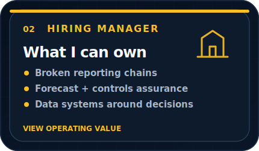
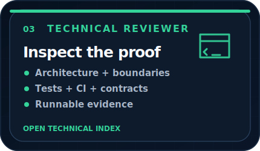
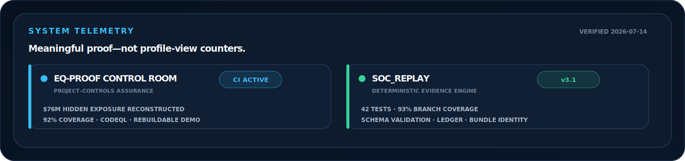
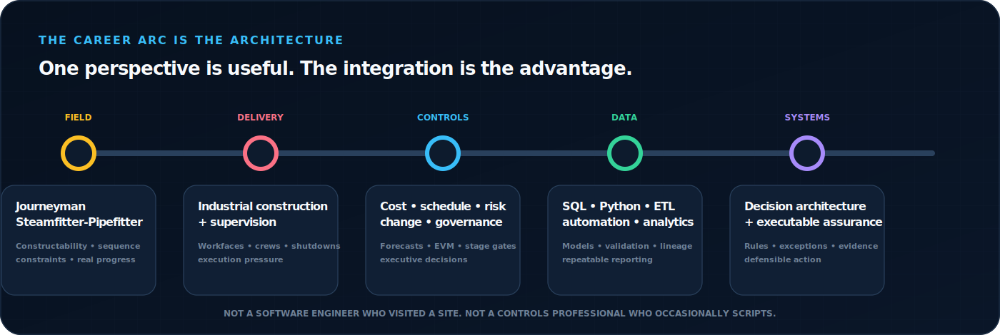
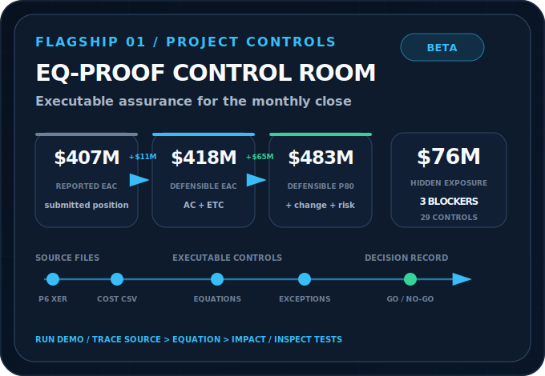
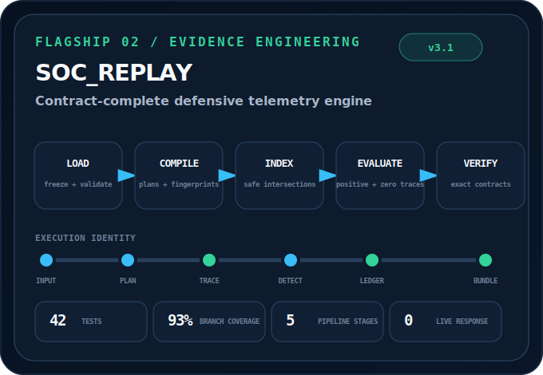
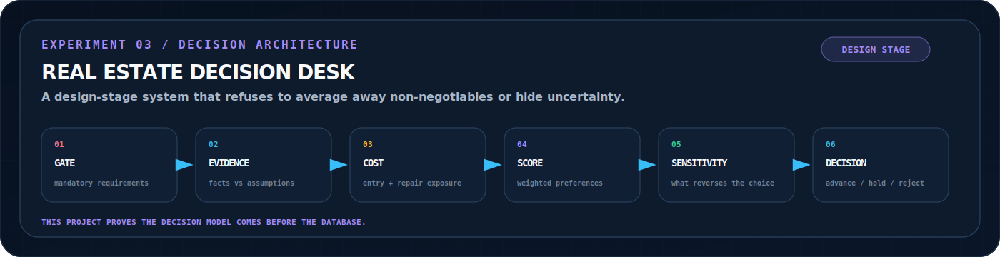
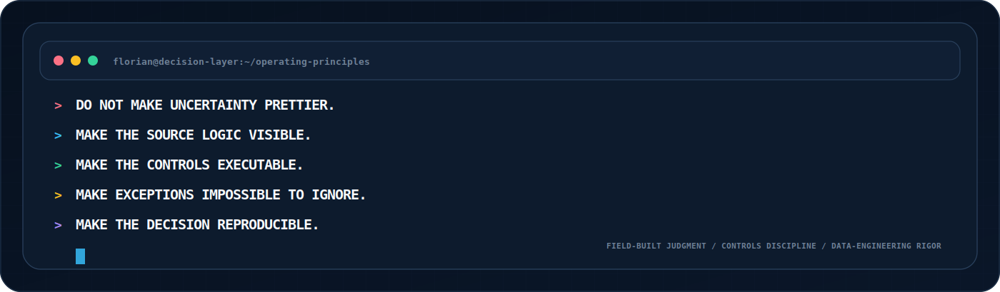

<p align="center">
  
</p>

<p align="center">
  <a href="https://florianstuettgen.github.io/EQ-Proof/"><strong>Open EQ-Proof Control Room</strong></a>
  &nbsp;·&nbsp;
  <a href="#flagship-systems"><strong>Inspect flagship systems</strong></a>
  &nbsp;·&nbsp;
  <a href="#technical-review"><strong>Technical evidence</strong></a>
</p>

<table>
<tr>
<td width="33.33%" valign="top">
<a href="#recruiter-scan"></a>
</td>
<td width="33.33%" valign="top">
<a href="#operating-value"></a>
</td>
<td width="33.33%" valign="top">
<a href="#technical-review"></a>
</td>
</tr>
</table>

<p align="center">
  
</p>

<a name="recruiter-scan"></a>
## 60-second profile

<table>
<tr><td width="24%"><strong>Role identity</strong></td><td>Project Controls & Data Systems Specialist</td></tr>
<tr><td><strong>Operating context</strong></td><td>Heavy industrial construction, LNG megaprojects, capital programs, and national shipbuilding environments</td></tr>
<tr><td><strong>Differentiator</strong></td><td>Field execution + controls governance + commercial context + technical implementation</td></tr>
<tr><td><strong>Core systems</strong></td><td>Primavera P6, SQL, Python, Power BI, Excel/Power Query, SAP, Oracle, Smartsheet, Procore</td></tr>
<tr><td><strong>Background</strong></td><td>Journeyman Steamfitter-Pipefitter · dual MBA credentials · MIT applied data-science training</td></tr>
<tr><td><strong>Location</strong></td><td>Edmonton, Alberta, Canada</td></tr>
</table>

> [!IMPORTANT]
> I work best where project information is important enough to drive decisions, but fragmented enough that nobody fully trusts the reporting chain.

<p align="center">
  
</p>

<a name="flagship-systems"></a>
## Flagship systems

<table>
<tr>
<td width="50%" valign="top">
<a href="https://github.com/FlorianStuettgen/EQ-Proof"></a>
<p align="center">
<a href="https://florianstuettgen.github.io/EQ-Proof/"><strong>Live synthetic demo</strong></a>
&nbsp;·&nbsp;
<a href="https://github.com/FlorianStuettgen/EQ-Proof/blob/main/docs/DEMO_PLAYBOOK.md">Walkthrough</a>
&nbsp;·&nbsp;
<a href="https://github.com/FlorianStuettgen/EQ-Proof">Source</a>
</p>
</td>
<td width="50%" valign="top">
<a href="https://github.com/FlorianStuettgen/SOC_Replay"></a>
<p align="center">
<a href="https://github.com/FlorianStuettgen/SOC_Replay#the-90-second-proof"><strong>90-second proof</strong></a>
&nbsp;·&nbsp;
<a href="https://github.com/FlorianStuettgen/SOC_Replay/blob/main/docs/22-Execution-Core.md">Execution core</a>
&nbsp;·&nbsp;
<a href="https://github.com/FlorianStuettgen/SOC_Replay/tree/main/tests">Tests</a>
</p>
</td>
</tr>
</table>

<p align="center">
<a href="https://github.com/FlorianStuettgen/real-estate-decision-desk"></a>
</p>

<a name="operating-value"></a>
## What I can be trusted to own

<table>
<tr>
<td width="50%" valign="top">

### Integrated controls data
Cost, schedule, risk, change, procurement, and progress data that disagree across contractors, systems, or reporting cycles.

### Forecast assurance
Forecasts that look credible but cannot be bridged to detail, assumptions, approved change, quantified risk, or accountable ownership.

### Reporting automation
Manual workbook chains and recurring report assembly that should become governed pipelines, reusable models, and exception-driven workflows.

</td>
<td width="50%" valign="top">

### Decision architecture
Operational questions that require explicit gates, assumptions, evidence, uncertainty, sensitivity, and preserved rationale—not merely a dashboard.

### Controls governance
Rules that exist as tribal knowledge, copied formulas, review habits, or undocumented expectations rather than executable controls.

### Technical translation
Work requiring a translator between field reality, project-controls governance, business decisions, and data engineering.

</td>
</tr>
</table>

The objective is not to automate every judgment. It is to automate the repeatable logic, expose the exceptions, preserve the assumptions, and leave accountable decisions with people.

<a name="technical-review"></a>
## Technical review

<details open>
<summary><strong>EQ-Proof — project-controls assurance evidence</strong></summary>
<br>

| Review question | Direct evidence |
| --- | --- |
| Does it solve a real controls problem? | [Control Room demo](https://florianstuettgen.github.io/EQ-Proof/) and [five-minute playbook](https://github.com/FlorianStuettgen/EQ-Proof/blob/main/docs/DEMO_PLAYBOOK.md) |
| Can it ingest native project files? | [Primavera P6 XER and cost/control inputs](https://github.com/FlorianStuettgen/EQ-Proof/blob/main/docs/PROJECT_CONTROLS.md) |
| Is the rule engine constrained? | [Product architecture](https://github.com/FlorianStuettgen/EQ-Proof/blob/main/docs/PRODUCT_ARCHITECTURE.md) and [threat model](https://github.com/FlorianStuettgen/EQ-Proof/blob/main/docs/THREAT_MODEL.md) |
| Is the output reproducible? | [Demo regeneration script](https://github.com/FlorianStuettgen/EQ-Proof/blob/main/scripts/regenerate_control_room_demo.py) and [CI workflow](https://github.com/FlorianStuettgen/EQ-Proof/blob/main/.github/workflows/ci.yml) |
| Is behaviour tested? | [Controls tests](https://github.com/FlorianStuettgen/EQ-Proof/blob/main/tests/test_controls.py) and 92% coverage gate |

```text
REPORTED EAC      $407M
DEFENSIBLE EAC    $418M
DEFENSIBLE P80    $483M
HIDDEN EXPOSURE    $76M
CLOSE DECISION    BLOCKED
```

</details>

<details>
<summary><strong>SOC_Replay — transferable engineering discipline</strong></summary>
<br>

| Review question | Direct evidence |
| --- | --- |
| Is execution explicit? | [Five-stage execution core](https://github.com/FlorianStuettgen/SOC_Replay/blob/main/docs/22-Execution-Core.md) |
| Are scenario outcomes exact? | [Contract validation](https://github.com/FlorianStuettgen/SOC_Replay/blob/main/docs/24-Contract-Validation.md) |
| Can internal tampering be detected? | [Execution-ledger design](https://github.com/FlorianStuettgen/SOC_Replay/blob/main/docs/23-Execution-Ledger.md) |
| Are boundaries explicit? | [Implementation state](https://github.com/FlorianStuettgen/SOC_Replay/blob/main/docs/14-Implementation-State.md) and simulation-only response model |
| Is quality enforced? | [Test suite](https://github.com/FlorianStuettgen/SOC_Replay/tree/main/tests), 42 tests, 93% branch coverage, schema validation, self-audit, and wheel build |

```text
LOAD → COMPILE → INDEX → EVALUATE → VERIFY
                ↓
      exact positive and zero-result traces
                ↓
       ledger root → bundle identity
```

</details>

<details>
<summary><strong>Technical toolkit and operating methods</strong></summary>
<br>

| Domain | Tools and methods |
| --- | --- |
| Project controls | Primavera P6, forecasting, EVM, variance analysis, schedule assurance, change, risk, stage-gate readiness |
| Data engineering | SQL, Python, ETL, data modelling, validation, automation, deterministic processing, schemas |
| Analytics | Power BI, Excel, Power Query, VBA, executive reporting, scenario and sensitivity analysis |
| Enterprise/project systems | SAP, Oracle, Smartsheet, Procore, SharePoint, Microsoft Project |
| Engineering workflow | Git, GitHub Actions, tests, static analysis, architecture records, reproducible evidence |
| Field/design context | Heavy industrial construction, piping systems, AutoCAD, Navisworks, Revit |

</details>

<p align="center">
  
</p>

<p align="center">
  <sub>This profile is built from custom, version-controlled SVG interface surfaces designed specifically for project-controls decision systems.</sub>
</p>
