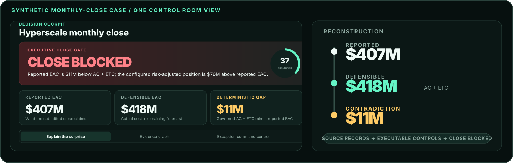

<h1 align="center">Project Controls Should Reconcile</h1>

  <strong>I build software that finds the gap between what a project reports and what its underlying records can support.</strong>

Construction delivery · Project controls · SQL · Evidence-backed decisions

  <a href="https://florianstuettgen.github.io/EQ-Proof/">Explore the working case</a> ·
  <a href="PAID_PILOT.md">Review the pilot scope</a> ·
  <a href="https://www.linkedin.com/in/florian-stuettgen">Contact me</a>

## What I do

Most close problems do not begin with an obviously absurd number.

They appear as plausible forecasts, schedules, change positions, and risk allowances that stop agreeing once they are traced back to the underlying detail.

I reconstruct those positions from the supplied project-controls evidence, test them against explicit controls, and show where the conclusion breaks down to the source record, control, and required action.

A typical review provides:

- A clear **ready**, **review**, or **blocked** conclusion
- A submitted-versus-reconstructed forecast bridge
- A ranked register of exceptions and unresolved assumptions
- A reproducible evidence path from source data to decision

## Working proof

### EQ-Proof Control Room

The synthetic case begins with a reported **$407M EAC**. The available cost detail reconstructs to **$418M**, exposing an **$11M contradiction** before declared change and risk are considered.

That does not prove that $418M is the correct forecast. It proves that the reported $407M cannot be relied upon without further explanation.

The result remains attached to the records and controls that produced it, so another reviewer can reproduce the conclusion rather than simply accept it.

[Open the browser workbench](https://florianstuettgen.github.io/EQ-Proof/) · [Review the worked case](https://github.com/FlorianStuettgen/EQ-Proof/blob/main/docs/SHOWCASE.md)

## Fixed-scope pilot

**One project. One reporting period. One decision that needs to hold up under review.**

The pilot works from an agreed set of Primavera P6, cost and forecast, change, risk, and optional SQL evidence.

The standard handoff includes:

- An executive decision brief
- A forecast-reconciliation bridge
- A prioritized exception register
- A source-to-conclusion evidence map
- A review session with the responsible team

The scope is deliberately bounded. The objective is not to replace the project-controls system. It is to determine whether the available evidence supports a specific reporting position.

[Review the Project Controls Close Integrity Pilot →](PAID_PILOT.md)

## When SQL is part of the problem

Sometimes the contradiction is not present in the source records. It is introduced by the reporting model.

Where necessary, I can include a bounded review of inherited SQL covering:

- Source, transformation, and metric lineage
- Join behaviour and row-multiplication risk
- Aggregation and filtering defects
- Dialect and portability hazards
- Privacy or unintended data exposure
- A validation-required repair plan

The aim is not to rewrite an entire reporting environment. It is to identify the logic that materially affects the decision under review.

## How I work

The engineering approach is conservative by design.

Data stays local where the workflow supports it. Controls and semantic boundaries are made explicit. Outputs are deterministic where deterministic claims are made. Evidence is separated from assumptions, and the system records what it can—and cannot—prove.

This makes the result easier to challenge, reproduce, and defend.

## Background

I work in project controls for large construction programs at the intersection of project delivery, SQL, data systems, and decision assurance.

My background spans field supervision, construction delivery, project controls, data engineering, graduate business education, and applied data science. That combination matters. I understand both how project information is produced and how it can become distorted on its way to a management decision.

## Additional engineering work

[SOC_Replay](https://github.com/FlorianStuettgen/SOC_Replay) applies the same evidence-first discipline to defensive security telemetry.

It uses deterministic scenario replay, explicit scenario contracts, and verifiable evidence bundles. The domain is different, but the standard is the same: a conclusion should remain traceable to what actually happened.

## Boundaries

This work supports project decisions. It does not issue an audit opinion, contractual certification, probabilistic risk forecast, or replacement schedule calculation.

Diagnostics are performed against supplied evidence and agreed controls. Production data is not modified, and confidential information should never be submitted through a public demo, repository, or GitHub issue.

## Contact

I schedule engagements in advance and keep the active workload deliberately limited.

For substantive project-controls, data-assurance, SQL, or recruiter inquiries aligned with project controls and data systems, [contact me on LinkedIn](https://www.linkedin.com/in/florian-stuettgen). 
Please include the problem, relevant context, and expected timing. I generally do not respond to generic sales, networking, or recruitment messages.

